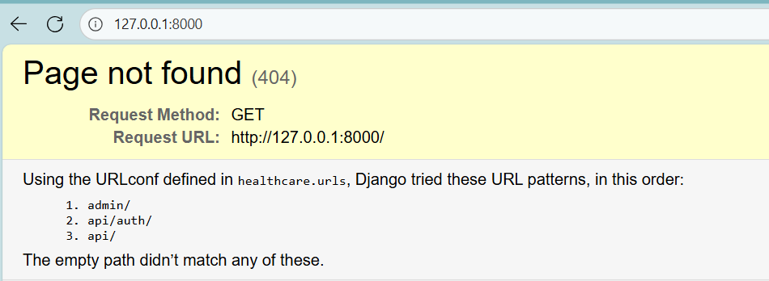

# Healthcare Backend – Setup & Usage Guide

This document walks you through installing, configuring, and running the Django Healthcare Backend, plus how to authenticate and use the core API endpoints.

---

## 1. Get the Source

Clone (recommended) or extract the provided archive:

```bash
git clone <repository_url>
cd healthcare_backend_Django
```

---

## 2. Create & Activate Virtual Environment (Windows PowerShell)

```bash
python -m venv healthcare_venv
healthcare_venv\Scripts\activate
```

If script execution is blocked, temporarily enable it (optional):

---

## 3. Install Dependencies

Dependencies are declared in `healthcare_backend/requirements.txt`.

```bash
cd healthcare_backend
pip install -r requirements.txt
```

---

## 4. Environment Variables

Create a `.env` file in `healthcare_backend/` (same folder as `manage.py`) based on `.env.example` if present. Typical variables you may need:

---

## 5. Database Setup & Migrations

Apply database migrations:

```bash
python manage.py makemigrations
python manage.py migrate
```

---

## 6. Create Superuser (Admin Portal Access)

```bash
python manage.py createsuperuser
```

Provide username, email, and password when prompted.

---

## 7. Run the Development Server

```bash
python manage.py runserver
```

Server runs at: `http://127.0.0.1:8000/`

---

## 8. Authentication Flow

1. Admin Login: `http://127.0.0.1:8000/admin`
2. Register a user: `POST /api/auth/register/`
3. Login to obtain tokens: `POST /api/auth/login/`
4. Include the token in `Authorization: Bearer <access_token>` for protected endpoints.

Store and reuse the access/refresh tokens as returned.

---

## 9. Core API Endpoints

Public / Landing:

```bash
GET /
```

Auth:

```bash
POST /api/auth/register/
POST /api/auth/login/
```

Protected Resources (CRUD – require Authorization header):

```bash
GET/POST   /api/doctors/
GET/PUT/DELETE /api/doctors/{id}/

GET/POST   /api/patients/
GET/PUT/DELETE /api/patients/{id}/

GET/POST   /api/mappings/
GET/PUT/DELETE /api/mappings/{id}/
```

---

## 10. Screenshots

**Root:**



**Admin:**


**Landing / Create User Prompt:**


**Register:**


**Login:**


**Doctors:**


**Patients:**


**Mappings:**


